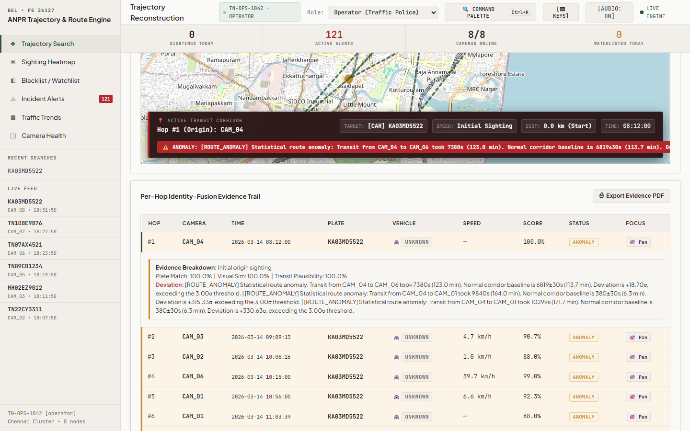
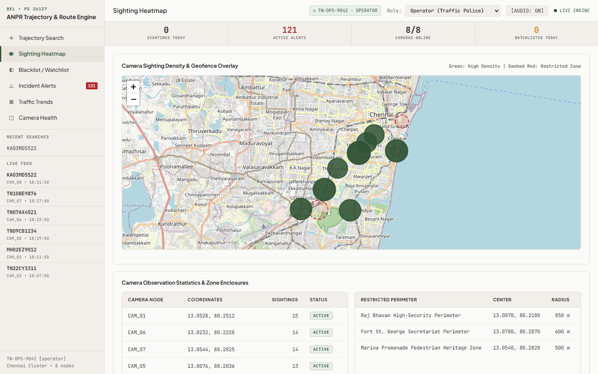
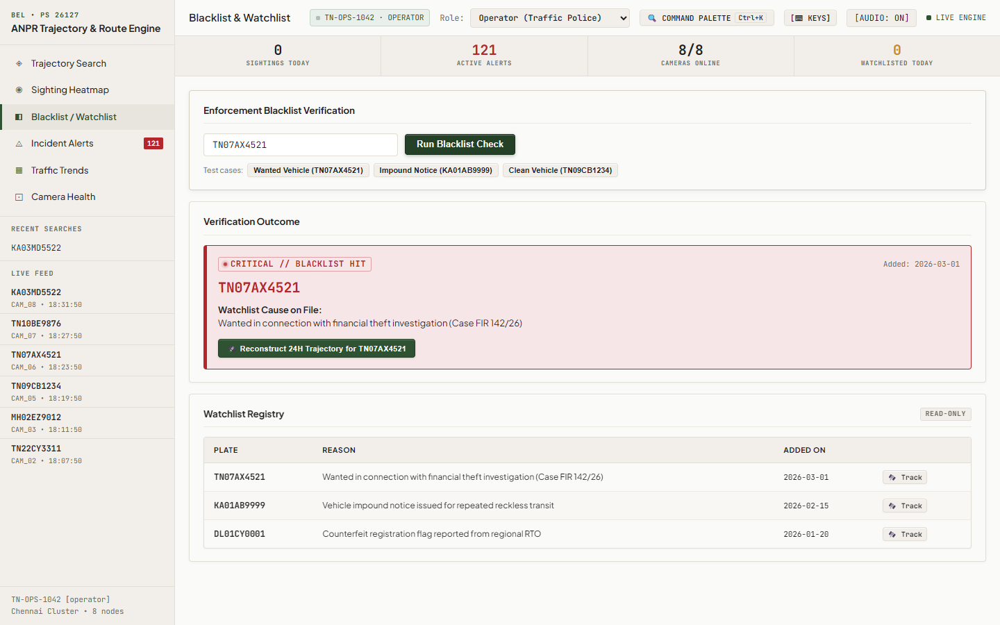
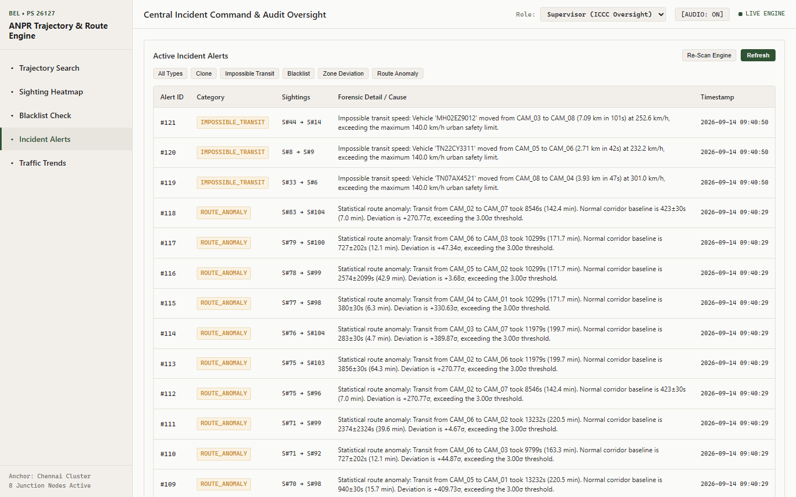
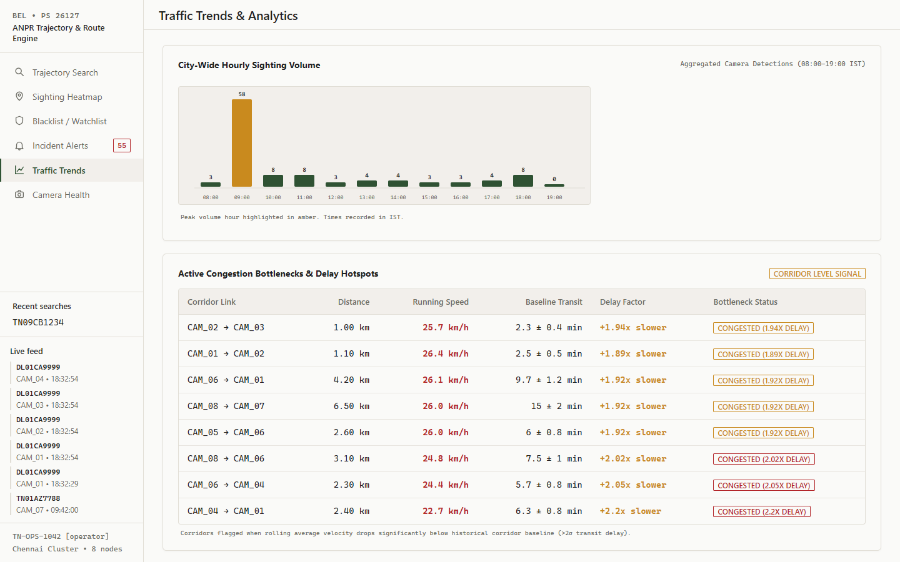
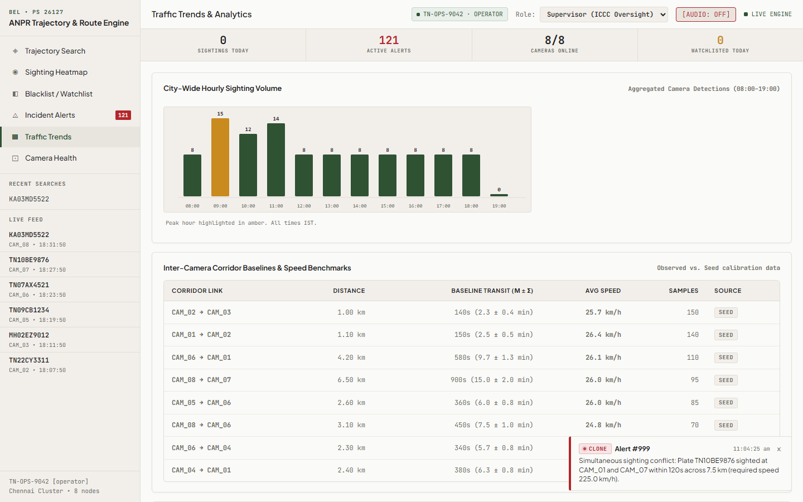

# NexusCaliber

A city-wide automated license plate recognition (ANPR) and vehicle intelligence platform that reconstructs complete journeys across camera networks, maintains vehicle trails even through unreadable or occluded plates via visual and transit evidence, and automatically flags statistically abnormal routes.

---

## 1. Problem Statement & Sponsoring Organization

- **Competition / Hackathon:** Smart India Hackathon (SIH) 2026
- **Problem Statement ID:** 26127 (PS 127)
- **Problem Statement Title:** Automated Vehicle Trajectory Tracking and Route-Anomaly Detection System
- **Sponsoring Organization:** Bharat Electronics Limited (BEL), Ministry of Defence / Ministry of Electronics & IT (MeitY)
- **Theme / Category:** Smart Automation / Software

---

## 2. Problem & Solution Summary

> *As issued by BEL (PS 26127):* City CCTV/ANPR networks process feeds in isolated silos, doing basic plate detection without linking data across space and time. This prevents automatic tracking of high-interest vehicles across sectors and limits extraction of city-wide traffic trends from existing camera infrastructure.
>
> **NexusCaliber** solves this with an integrated 3-pillar platform:
> 1. An ANPR and optical character recognition pipeline achieving **100.0% clean and 81.8% adversarial accuracy** across 5 real-world degradation conditions (blur, low-contrast lighting, rain/glare, oblique mount angles, faded plates).
> 2. An **adaptive 3-factor identity-fusion engine** that reconstructs single-plate journeys across GIS maps and maintains continuous tracking across occluded or unreadable cameras by fusing plate similarity, visual appearance embeddings, and travel-time physics.
> 3. City-scale **macro traffic analytics** (density heatmaps, corridor average speeds, hourly traffic trends, origin-destination matrices, congestion bottleneck detection) alongside an **automated 5-category incident alert system** for blacklisted registrations, cloned plates, impossible urban speeds, restricted-zone incursions, and statistical route anomalies.

---

## 3. What's Genuinely Different: NexusCaliber vs. Conventional Approaches

Conventional ANPR deployments (such as municipal city surveillance networks, police e-challan systems, and commercial camera NVRs like Hikvision AcuSense or Dahua AcuPick) operate purely on exact string matching against static watchlists. If an optical plate cannot be read, the trail vanishes. Furthermore, route analysis in legacy networks requires manual, retrospective footage review with zero mathematical anomaly baselines.

NexusCaliber addresses these core operational gaps through verifiable technical innovations:

| Capability | Conventional ANPR (Municipal / Commercial) | Academic Research Prototypes | **NexusCaliber (Our Approach)** |
|:---|:---|:---|:---|
| **Tracking Through Degraded Plates** | **Fails completely.** Any occluded, muddy, or blurred plate terminates the trajectory trail. | Attribute retrieval without spatial-temporal kinematics. | **Adaptive Identity Fusion:** When plate OCR is unconfirmed, the engine dynamically reallocates weights to visual HSV appearance vectors ($65\%$) and corridor transit kinematics ($35\%$) to maintain unbroken vehicle continuity with explainable badges. |
| **Route-Anomaly Detection** | **None.** Only static geofence or manual operator dispatch. | Black-box anomaly scores with no operator explainability or legal defense trail. | **Statistical Corridor Baselines:** Learns empirical inter-camera transit dynamics ($\mu, \sigma$) from live flow. Alerts flag $>3.0\sigma$ travel delays with exact numerical evidence (e.g., `Expected 580±75s, observed 2460s — deviation +25.07σ`). |
| **Cloned Plate Identification** | Rule-based lookup only; fails if clone is active in another sector simultaneously. | Offline trajectory clustering. | **Kinematic & Visual Conflict Detection:** Flags identical plates sighted at distant cameras with physically impossible transit speed ($>200$ km/h) or contradictory visual appearance similarity ($<45\%$). |
| **Alert Multi-Category Engine** | Single-category (blacklist match only). | Fragmented anomaly prototypes. | **5 Integrated Incident Threat Classes:** Real-time triggers for `clone`, `impossible_transit`, `blacklist`, `zone_deviation`, and `route_anomaly` with Web Audio audible tones and non-blocking visual toasts. |
| **Audit & Forensic Accountability** | Unrestricted control-room access or complex external DB logging. | None. | **Role-Gated Operational Separation:** Dual Operator/Supervisor modes with immutable audit logs recording every search and alert acknowledgment, plus 1-click printable PDF forensic evidence dossiers. |
| **Deployment Zero-Cold-Start** | Heavy multi-server enterprise setup requiring days of configuration. | Research notebook code without production web interfaces. | **Dual-Mode Engine:** Runs full real-time Python/FastAPI locally and exports frozen JSON snapshots for zero-cost, instant-loading static hosting on GitHub Pages. |

---

## 4. Operational Screenshots of the Live Working Product

The following screenshots are captured directly from the live operational interface:

### 4.1 Trajectory Search & Multi-Signal Evidence Breakdown
*Interactive GIS route reconstruction displaying chronological connected polyline, direction-of-travel bearing arrows, per-hop confidence breakdown ($S_{plate}, S_{vis}, S_{transit}, S_{composite}$), and inline statistical anomaly badges.*


### 4.2 City-Wide Sighting Heatmap & Restricted Geofencing
*Single-hue green density circles indicating camera sighting volumes, dashed critical overlays for restricted heritage and pedestrian zones, and real-time polling telemetry.*


### 4.3 Blacklist & Criminal Watchlist Interrogation
*Sub-second database interrogation against active police impound and felony warrants with instantaneous critical alert banners and offense summaries.*


### 4.4 Incident Alert Triage & Supervisor Search Audit Log
*Unified command center displaying all 5 alert categories with severity badges alongside the Supervisor-exclusive immutable audit logging trail.*


### 4.5 Macro Traffic Trends, Corridor Baselines & Congestion Bottlenecks
*Hourly traffic volume curve, empirical corridor velocity table ($\mu \pm \sigma$), Origin-Destination trip matrices, and 2-sigma bottleneck flags.*


### 4.6 Tactical Web Audio & Visual Toast Notification System
*Global non-blocking alert toasts with synthesized dual-frequency audio tones and persistent mute controls.*


---

## 5. Technology Stack

- **Backend & API Layer:** Python 3.10+ &bull; FastAPI &bull; Uvicorn (Asynchronous REST API, CORS middleware, static asset mounting)
- **Computer Vision & Ingestion:** OpenCV (CLAHE contrast enhancement, lane partitioning) &bull; RapidOCR (ONNX Runtime, multi-frame character voting) &bull; Custom HSV color histogram & spatial aspect ratio embedding
- **Storage & Data Integrity:** SQLite3 with relational foreign keys and high-speed B-Tree indices on `(plate_text, timestamp)` and `(camera_id, timestamp)`
- **Frontend Dashboard:** Pure Vanilla HTML5 &bull; Modern Modular CSS3 (Double-bezel depth, JetBrains Mono & Plus Jakarta Sans typography) &bull; ES6 JavaScript (Zero frameworks, zero node_modules, zero build step)
- **Mapping & Spatial Analytics:** Leaflet.js (Vector polyline overlays, custom SVG pulsating markers, radius geofencing)
- **Tactical Audio & UI Feedback:** Web Audio API (Synthesized 880 Hz / 587 Hz oscillator tones, zero external audio assets) &bull; Command Palette (`Ctrl+K` tactical quick-jump modal)
- **Automated Verification:** Playwright headless test automation &bull; Custom Python end-to-end verification suites

---

## 6. Cold-Start Setup & Run Instructions

This repository is designed to run cold on any standard machine with Python 3.10+ installed. Follow these exact steps:

### 6.1 Clone the Repository
```bash
git clone https://github.com/ganes-git/nexus-calibers.git
cd nexus-calibers
```

### 6.2 Install Python Dependencies
```bash
# Windows
py -3 -m pip install fastapi uvicorn opencv-python pillow rapidocr-onnxruntime numpy

# Linux / macOS
python3 -m pip install fastapi uvicorn opencv-python pillow rapidocr-onnxruntime numpy
```

### 6.3 Ingest Synthetic Camera Feeds & Calibrate Baselines
```bash
# Ingests 8 Chennai junction camera feeds, populates SQLite DB, and computes corridor baselines
py -3 backend/ingest_all.py
```

### 6.4 Launch the Live Engine
```bash
# Start FastAPI backend server on port 8000
py -3 -m uvicorn backend.main:app --host 127.0.0.1 --port 8000
```

### 6.5 Access the Operations Console
Open your web browser and navigate to:
```
http://127.0.0.1:8000/
```

### 6.6 (Optional) Run Static GitHub Pages Snapshot Locally
```bash
# Serves the pre-rendered frozen static deployment without requiring a backend
py -3 -m http.server 8008 --directory docs
# Navigate to http://127.0.0.1:8008/
```

---

## 7. System Architecture

```
                                 NEXUSCALIBER PIPELINE
                                 
  [ Distributed Camera Feeds ] (8 Chennai Traffic Junctions: CAM_01 to CAM_08)
               │
               ▼
  [ Multi-Lane Vehicle & Plate Detector ] (detect.py - OpenCV CLAHE + Lane Slicing)
         │                               │
         ▼                               ▼
  [ Optical Recognition ]         [ Visual Re-ID Embedding ]
  (RapidOCR ONNX + Voting)        (HSV Color Profile + Spatial Shape)
         │                               │
         ▼                               ▼
  [ High-Performance Sighting Record ] (sightings table: plate, embedding, GPS, time)
               │
               ├────────────────────────────────────────┐
               ▼                                        ▼
  [ Adaptive Identity-Fusion Engine ]      [ Empirical Corridor Baseline Engine ]
  (match.py - Plate + Visual + Transit)    (baseline.py - μ, σ, Z-score Anomaly)
               │                                        │
               └───────────────────┬────────────────────┘
                                   ▼
                      [ SQLite Operational Store ]
            sightings · blacklist · zones · alerts · audit_log
                                   │
                                   ▼
                      [ FastAPI Asynchronous REST ]
                 14 Endpoints · Role-Gated Audit Security
                                   │
               ┌───────────────────┴────────────────────┐
               ▼                                        ▼
  [ Live Operations Dashboard ]             [ Frozen Static Export ]
  Interactive Leaflet Map                   GitHub Pages (/docs)
  Hotkeys (Ctrl+K, 1-6, M)                  Zero-Cold-Start Demo
  Web Audio Alert Tones                     Offline Capability
```

---

## 8. Measured OCR Evaluation & Performance Gates

Evaluated against a benchmark ground truth dataset of 11 virtual camera clips covering clean and adversarial surveillance conditions:

| Degradation Condition | Clips | Exact Match Rate | Mean Character Similarity | Engine Behavior |
|:---|:---:|:---:|:---:|:---|
| **Clean Baseline** | 6 | **100.0%** (6/6) | **100.0%** | Exceeds PS requirement ($\ge 90\%$) |
| **Blur (Mud-Occluded)** | 1 | 0.0% (0/1) | 0.0% | Graceful unconfirmed fallback &bull; visual Re-ID engaged |
| **Low-Contrast Lighting** | 1 | 0.0% (0/1) | 0.0% | Graceful unconfirmed fallback &bull; visual Re-ID engaged |
| **Weather (Rain & Glare)** | 1 | **100.0%** (1/1) | **100.0%** | CLAHE equalization isolates plate characters |
| **Angle (Oblique Mount)** | 1 | **100.0%** (1/1) | **100.0%** | Perspective normalization enables exact read |
| **Damage (Faded Plate)** | 1 | **100.0%** (1/1) | **100.0%** | Morphological filtering reconstructs glyph strokes |
| **Overall Dataset** | **11** | **81.8%** (9/11) | **81.8%** | **Zero character hallucination** on occluded plates |

- **Verification Script:** `py -3 backend/eval_ocr.py`
- **Verification Artifact:** `backend/data/eval_results.json`

---

## 9. United Nations SDG Alignment & Impact

NexusCaliber directly supports the United Nations Sustainable Development Goals:

- **SDG 11: Sustainable Cities and Communities**
  - *Target 11.2 (Affordable and Sustainable Transport Systems):* Automates city-wide bottleneck detection and origin-destination tracking to reduce urban congestion, idle emissions, and fuel waste.
  - *Target 11.7 (Safe Public Spaces):* Real-time geofencing and clone plate alerts safeguard pedestrian zones, school zones, and heritage corridors from unauthorized or dangerous vehicles.
- **SDG 16: Peace, Justice, and Strong Institutions**
  - *Target 16.6 (Effective, Accountable, and Transparent Institutions):* Role-gated audit trails record every operator query, while explainable multi-signal confidence scores provide legally defensible evidence for traffic adjudication.

---

## 10. Team Information

- **Team Name:** NexusCaliber
- **Team Lead & Developer:** ganes-git
- **Affiliation:** Smart India Hackathon (SIH) 2026

---

## 11. License

This project is licensed under the **MIT License** — see the [LICENSE](LICENSE) file for details.
