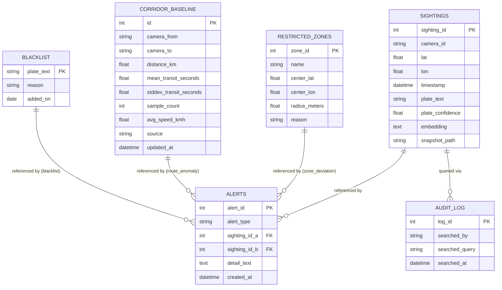

# SCHEMA.md — City-Wide ANPR Trajectory & Route-Anomaly Engine

Traces to TRD.md components and PRD.md features. Reproduces this project's already-decided schema and API design accurately — nothing here is newly invented, except the notification-related additions explicitly marked **(new)**.

---

## Entity List

| Entity | Maps to |
|---|---|
| `sightings` | ANPR/OCR pipeline, identity-fusion engine (TRD) |
| `blacklist` | Blacklist Check feature (PRD) |
| `restricted_zones` | Heatmap zone overlay, zone_deviation alerts (PRD) |
| `corridor_baseline` | Corridor baseline & route-anomaly engine (PRD core differentiator) |
| `audit_log` | Supervisor audit-log feature (PRD) |
| `alerts` | Alert system — all five types (PRD) |

---

## ER Diagram

---

## Per-Table Field List

### `sightings`
| Field | Type | Constraint |
|---|---|---|
| sighting_id | INTEGER | PK, autoincrement |
| camera_id | TEXT | NOT NULL |
| lat | REAL | NOT NULL |
| lon | REAL | NOT NULL |
| timestamp | DATETIME | NOT NULL |
| plate_text | TEXT | nullable (unconfirmed plates) |
| plate_confidence | REAL | nullable |
| embedding | TEXT (JSON) | NOT NULL — serialized float vector |
| snapshot_path | TEXT | nullable |

### `blacklist`
| Field | Type | Constraint |
|---|---|---|
| plate_text | TEXT | PK |
| reason | TEXT | NOT NULL |
| added_on | DATE | NOT NULL |

### `restricted_zones`
| Field | Type | Constraint |
|---|---|---|
| zone_id | INTEGER | PK, autoincrement |
| name | TEXT | NOT NULL |
| center_lat | REAL | NOT NULL |
| center_lon | REAL | NOT NULL |
| radius_meters | REAL | NOT NULL |
| reason | TEXT | nullable |

### `corridor_baseline`
| Field | Type | Constraint |
|---|---|---|
| id | INTEGER | PK, autoincrement |
| camera_from | TEXT | NOT NULL |
| camera_to | TEXT | NOT NULL |
| distance_km | REAL | NOT NULL |
| mean_transit_seconds | REAL | NOT NULL |
| stddev_transit_seconds | REAL | NOT NULL, floored to a small positive constant (documented in code, avoids divide-by-zero) |
| sample_count | INTEGER | NOT NULL — also serves as the path-frequency signal |
| avg_speed_kmh | REAL | derived: `distance_km / (mean_transit_seconds/3600)` |
| source | TEXT | CHECK IN ('seed', 'observed', 'mixed') |
| updated_at | DATETIME | NOT NULL |

### `audit_log`
| Field | Type | Constraint |
|---|---|---|
| log_id | INTEGER | PK, autoincrement |
| searched_by | TEXT | NOT NULL — role string ("operator"/"supervisor") from the frontend |
| searched_query | TEXT | NOT NULL |
| searched_at | DATETIME | NOT NULL |

### `alerts`
| Field | Type | Constraint |
|---|---|---|
| alert_id | INTEGER | PK, autoincrement |
| alert_type | TEXT | CHECK IN ('clone', 'impossible_transit', 'blacklist', 'zone_deviation', 'route_anomaly') |
| sighting_id_a | INTEGER | FK → sightings.sighting_id |
| sighting_id_b | INTEGER | FK → sightings.sighting_id, nullable |
| detail_text | TEXT | NOT NULL — must state the specific numbers/reason, never a bare flag |
| created_at | DATETIME | NOT NULL |

---

## API Contracts

Mapped to TRD.md's API layer. Existing endpoints (already decided) plus one new field noted where the alert-notification feature touches the contract.

| Endpoint | Method | Request | Response (shape) |
|---|---|---|---|
| `/api/health` | GET | — | `{status: "ok"}` |
| `/api/trajectory` | GET | `query`, `date_from`, `date_to`, `role` | `[{sighting_id, camera_id, lat, lon, timestamp, snapshot_path, plate_score, visual_score, transit_score, composite_score, timing_anomaly_score, is_path_rare}]` |
| `/api/heatmap` | GET | `date_from`, `date_to` | `[{camera_id, lat, lon, count}]` |
| `/api/zones` | GET | — | `[{zone_id, name, center_lat, center_lon, radius_meters}]` |
| `/api/corridor-baseline` | GET | — | `[{camera_from, camera_to, mean_transit_seconds, stddev_transit_seconds, sample_count, avg_speed_kmh, source}]` |
| `/api/traffic-trend` | GET | `date_from`, `date_to` | `[{hour, count}]` |
| `/api/blacklist/check` | GET | `plate`, `role` | `{match: bool, entry: {plate_text, reason, added_on} \| null}` |
| `/api/alerts` | GET | — | `[{alert_id, alert_type, sighting_id_a, sighting_id_b, detail_text, created_at}]` |
| `/api/alerts/scan` | POST | — | `{alerts_created: int}` — recomputes all five alert types |
| `/api/audit-log` | GET | — | `[{log_id, searched_by, searched_query, searched_at}]` |
| **`/api/alerts/unseen` (new)** | GET | `since_id` (optional) | `[{alert_id, alert_type, detail_text, created_at}]` — polled by the new toast/audio layer to detect alerts the client hasn't shown yet; a thin read over the existing `alerts` table, no new persisted state |

**Static-mode note:** in `STATIC_MODE=true` (GitHub Pages export), each of the above is served from a matching pre-generated JSON file rather than a live query — same shape, same field names, generated once at export time from a fixed demo dataset. The new `/api/alerts/unseen` endpoint has no static equivalent (nothing new happens in a frozen snapshot) — the frontend's alert layer is inert in static mode by design, not a bug.

---

## Indexing / Validation Notes

- Index on `sightings(camera_id, timestamp)` — supports both the trajectory-reconstruction query pattern and the heatmap's per-camera aggregation.
- Index on `blacklist(plate_text)` — already the primary key, so covered by default.
- Index on `alerts(created_at)` — supports "most recent first" ordering on the Alerts view without a full table scan as the alert count grows.
- Validation: `lat`/`lon` on `sightings` and `restricted_zones` should fall within a plausible bound around the project's real-world anchor coordinates (Chennai reference point) — reject values that would plot outside any reasonable city radius, catching a bad GPS-generation bug early rather than silently rendering a broken map pin.
- Validation: `alert_type` and `corridor_baseline.source` are constrained to their enumerated values at the database level (`CHECK` constraints), not just trusted from application code — cheap insurance against a bug silently writing an unrecognized value.

---

## Assumptions & Open Questions

- **[NEEDS INPUT]** Whether `/api/alerts/unseen` should be polled on an interval or pushed via WebSocket — polling proposed here as the simpler default for a hackathon-scale build; not previously decided.
- **[NEEDS INPUT]** Team size & skills, published judging criteria — same gaps noted in PRD.md and TRD.md, repeated here since they weren't provided and shouldn't be silently assumed away.
- The `corridor_baseline.source` field (`seed` vs `observed` vs `mixed`) is a deliberate, already-decided honesty mechanism from this project's prior work — synthetic calibration rows must never be indistinguishable from real detections in the schema or the UI. Preserved as-is here, not altered.
