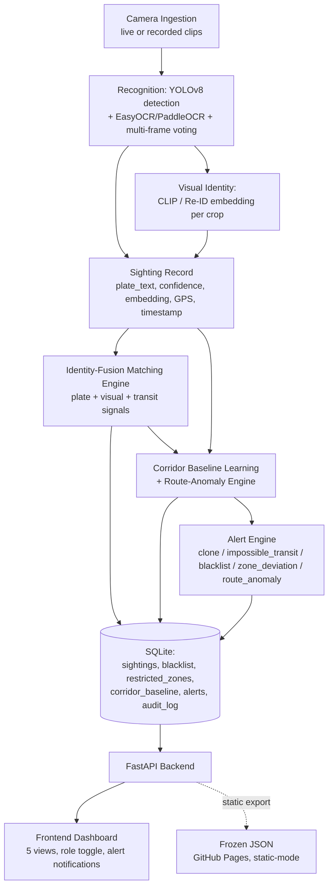

# TRD.md — City-Wide ANPR Trajectory & Route-Anomaly Engine

Traces to PRD.md. No UI detail here (see UI-UX.md), no business goals invented here.

---

## Architecture Overview

---

## Tech Stack & Justification

Every choice below is tied to a constraint already established for this project, not a fresh preference.

| Component | Choice | Justification |
|---|---|---|
| Detection | YOLOv8 (pretrained) | No training data available; must work same-day with no fine-tuning. |
| OCR | EasyOCR / PaddleOCR (pretrained) | Pretrained, reasonable multi-script support relevant to Indian plates; fallback pair in case one installs poorly in the build environment. |
| Visual embedding | OpenCLIP ViT-B-32, with a documented upgrade path to a VeRi-776-pretrained vehicle-Re-ID backbone | CLIP is a defensible same-day default; a Re-ID-specific backbone is the identified upgrade for discriminating near-identical vehicles (design work already done, not yet implemented — see identity-fusion upgrade in prior project decisions). |
| Backend | Python + FastAPI | Fast to stand up solo/small-team; async-friendly for the alert-scan and static-export workflows already designed. |
| Database | SQLite | Zero-ops, sufficient at demo scale. **Explicit non-goal:** production scaling to Postgres/pgvector is out of scope for this MVP (tradeoff, not an oversight). |
| Frontend | Vanilla HTML/CSS/JS, no framework, no build step | Established constraint from this project's design discipline — keeps the frontend dependency-free and fast to iterate on inside an agentic build workflow. |
| Maps | Leaflet.js (CDN) | Lightweight, no build step, matches the no-framework constraint. |
| Hosting | Dual-mode: live FastAPI locally + a frozen static JSON export on GitHub Pages | GitHub Pages cannot run a Python backend, a database, or ML models — confirmed technical constraint, not a preference. The static export gives a permanent, zero-cost, zero-cold-start public link; the live mode gives full real querying for local demos. Both from one codebase via a `STATIC_MODE` flag in a single data-access module. |

---

## System Components

Each maps to a specific PRD feature.

| Component | File(s) | PRD feature |
|---|---|---|
| Detection | `detect.py` | ANPR/OCR pipeline |
| OCR + voting | `ocr.py`, `vote.py` | ANPR/OCR pipeline, measured accuracy |
| Visual embedding | `embed.py` | Identity-fusion trajectory matching |
| Identity fusion | `match.py` (+ planned `fit_score_distributions.py`, `eval_match.py`) | Identity-fusion trajectory matching |
| Corridor baseline + anomaly | `baseline.py` | Corridor baseline learning + route-anomaly scoring |
| Ingestion orchestration | `ingest_all.py` | All pipeline features |
| API layer | `main.py` / `routes/` | All dashboard-facing features |
| Database | `anpr.db` (SQLite) — see SCHEMA.md | All persisted features |
| Frontend data access | `dataSource.js` (dual-mode: live API / static JSON) | Dashboard, dual hosting |
| Frontend views | 5 view modules | Trajectory Search, Heatmap, Blacklist, Alerts, Traffic Trends |
| Alert notification layer | new: toast + audio manager | New alert-sound/popup requirement |
| Static export | `export_static.py` | Dual hosting |

---

## Data Flow

1. A clip is ingested → detection produces vehicle crops → OCR + multi-frame voting produces `plate_text`/`plate_confidence` (or `unconfirmed`) → CLIP/Re-ID embedding produces a visual vector → a `Sighting` record is written (plate, confidence, embedding, GPS, timestamp).
2. The identity-fusion engine scores candidate sighting pairs (plate + visual + transit signals) to reconstruct trajectories.
3. The corridor-baseline engine recomputes per-camera-pair mean/stddev transit time and path frequency from confirmed same-vehicle hops (seeding synthetic samples where real samples are too few, explicitly labeled `source='seed'`).
4. Every hop is scored against the corridor baseline; alerts (`clone`, `impossible_transit`, `blacklist`, `zone_deviation`, `route_anomaly`) are generated and written to the `alerts` table with an explainable `detail_text`.
5. The FastAPI layer serves all of the above; every trajectory/blacklist query is written to `audit_log`.
6. The frontend's `dataSource.js` either calls this live API (`STATIC_MODE=false`, local/demo) or reads a pre-exported JSON snapshot (`STATIC_MODE=true`, GitHub Pages) — same view code, two data sources.
7. **New in this revision:** every alert write additionally triggers a frontend notification (toast + optional sound) the next time the Alerts view polls or the WebSocket/interval check fires — see UI-UX.md for exact behavior and NFR below for the delivery contract.

---

## External APIs / Integrations

Real ones only — no placeholders:
- **Leaflet.js** (CDN) — map rendering.
- **MapTiler or Mapbox tile API** (optional) — used only if a `MAP_API_KEY` is supplied; automatic fallback to standard OpenStreetMap tiles (with a CSS filter for palette consistency) if no key is present. No hard dependency.
- **GitHub API** — used at deploy time only, to push the repo and enable GitHub Pages via a personal access token.

No other third-party integrations exist or are assumed.

---

## Non-Functional Requirements

Realistic for a hackathon-scale prototype, not production SLAs:

- **Performance:** trajectory and alert queries should return within ~2 seconds at demo-scale data (8 cameras, low sighting volume). **Not benchmarked at city scale — explicitly out of scope for this MVP**, not silently assumed to hold.
- **Security:** the Operator/Supervisor toggle is a UI-only simulation with no backend enforcement — stated plainly in-product (a code comment and a README line), not implied to be real access control.
- **Offline / backend-unreachable behavior:** [NEEDS INPUT — not previously specified in this project.] Proposed default, flagged as an assumption: the frontend shows an explicit "backend unreachable" state rather than a blank screen or silent failure, in both live and static modes.
- **Zero-console-error requirement (new, explicitly requested for this revision).** The frontend must load and be operable through all five views with zero uncaught JavaScript errors and zero unhandled promise rejections in the browser console. This is not a style preference — it is a checked gate: the existing build-verification process (three checks run before the project is considered locally complete) gets a fourth check added — open the browser console, click through all five views plus at least one deliberate error case (e.g. a blacklist search with no match, a trajectory query for a nonexistent plate), and confirm the console is clean. Any error found blocks sign-off until fixed.
- **Alert delivery (new, explicitly requested for this revision):** every alert must produce a visible toast notification and, unless muted, an audible tone. Requirements: non-blocking (never a modal that halts interaction), dismissible, no repeat sound for an alert already shown once, a persistent mute toggle that survives a page reload, and a **visual-first design** — sound is additive, never the only signal, since a sound-only alert is inaccessible to a Deaf/hard-of-hearing operator and unreliable in a noisy control room. Tone should be a short, professional single/double beep — explicitly not a jarring siren or a cutesy chime, to stay consistent with this project's "serious operations tool" design discipline (see UI-UX.md).

---

## Deployment Plan

Dual-mode, specific to this project's demo/judging constraints (already decided, not new):
1. **Local/live demo:** Docker container running the full FastAPI backend + SQLite + ML pipeline, served on localhost for full, real querying during a live judged demo.
2. **Public/static link:** `export_static.py` snapshots the current database into JSON files covering the fixed demo scenarios (known ground-truth plates, full alerts list, full corridor-baseline table, traffic-trend data); the frontend is copied into a `/docs` folder with `STATIC_MODE=true`, pushed to GitHub, and served via GitHub Pages — free, permanent, no cold start. This link is for pre/post-judging review, not a substitute for the live demo's real query capability.

---

## Requirement Traceability Table

| PRD Feature | TRD Component |
|---|---|
| ANPR/OCR pipeline, measured accuracy | `detect.py`, `ocr.py`, `vote.py` |
| Trajectory survives unreadable plate | `embed.py`, `match.py` |
| Route-anomaly detection (core differentiator) | `baseline.py` |
| Clone / blacklist / impossible-transit / zone / route-anomaly alerts | `baseline.py`, `match.py`, alert-scan endpoint, `alerts` table |
| Trajectory Search view w/ confidence breakdown | `GET /api/trajectory`, frontend view 1 |
| Heatmap w/ restricted zones | `GET /api/heatmap`, `GET /api/zones`, frontend view 2 |
| Blacklist check | `GET /api/blacklist/check`, frontend view 3 |
| Alerts + role-gated audit log | `GET /api/alerts`, `GET /api/audit-log`, frontend view 4 |
| Corridor average speed, traffic trend | `GET /api/corridor-baseline`, `GET /api/traffic-trend`, frontend view 5 |
| Audible/visual alert notifications | New toast + audio manager (frontend, global) |
| Zero-console-error gate | New Check 4 in local verification |
| Dual hosting | `STATIC_MODE` flag, `export_static.py`, GitHub Pages config |

---

## Assumptions & Open Questions

- **[NEEDS INPUT]** Offline/backend-unreachable UX — proposed a default above, not previously specified.
- **[NEEDS INPUT]** Team size & skills — affects nothing architecturally documented here, but affects how much of the "planned, not yet implemented" work (identity-fusion upgrade, O-D pairing) is realistic before submission.
- The identity-fusion likelihood-ratio upgrade (replacing hand-weighted `composite_score`) is **designed, not yet implemented** in the actual codebase as of this document — do not present it as built without checking current implementation status first.
